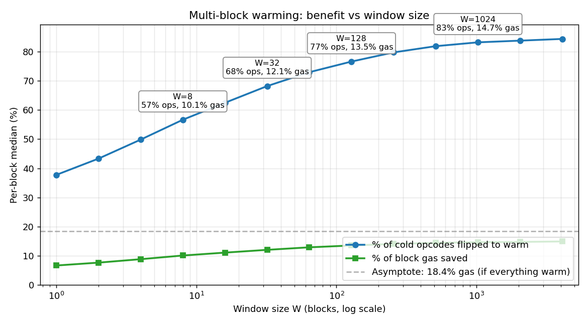
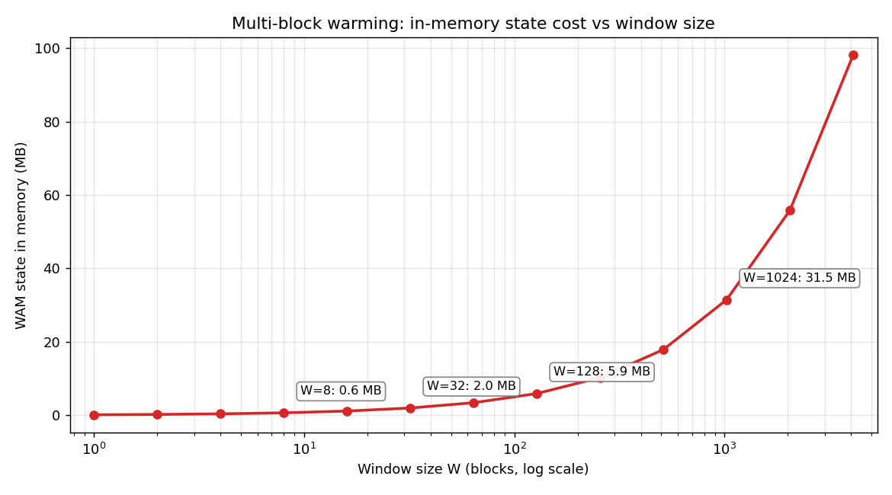

# Window-size trade-off: state cost vs warming benefit

How does the warm-access multiset (WAM) state size grow with the window W, and how does that compare to the warming benefit gained per block?

## Method

For each `W ∈ {1, 2, 4, ..., 2048}` we maintain a refcounted multiset over the rolling last W blocks of Block Access Lists and record, per block:

- **WAM size** = number of distinct items currently held (the dominant in-memory state cost);
- **Hits** = number of cold access opcodes in this block whose item is in the WAM (would flip cold → warm under multi-block warming);
- **Cold count** = total cold access opcodes in this block (the ceiling for hits).

Each W is evaluated on the subset of blocks with full W-block lookback within our data ("fair subset"). Sample: 5731 mainnet blocks (24981001 → ~24986731).

## Headline numbers (mean per block, fair subset)

| W | Time back | WAM items | WAM MB @ 60 B/item | Hits/block | % of cold ops flipped | Hits per million WAM items |
|---:|---:|---:|---:|---:|---:|---:|
| 1 | 12 s | 1 820 | < 1 | 1 001 | 43 % | 550 k |
| 4 | 48 s | 6 029 | < 1 | 1 278 | 55 % | 212 k |
| **8** | **96 s** | **10 664** | **0.6** | **1 430** | **61 %** | **134 k** |
| 16 | 3.2 min | 18 669 | 1.1 | 1 556 | 66 % | 83 k |
| **32** | **6.4 min** | **32 569** | **2.0** | **1 671** | **71 %** | **51 k** |
| 64 | 12.8 min | 56 542 | 3.4 | 1 772 | 76 % | 31 k |
| **128** | **25.6 min** | **98 226** | **5.9** | **1 855** | **79 %** | **19 k** |
| 256 | 51.2 min | 170 793 | 10.2 | 1 924 | 82 % | 11 k |
| 512 | 102.4 min | 297 785 | 17.9 | 1 964 | 84 % | 6.6 k |
| 1024 | 3.4 h | 524 624 | 31.5 | 2 010 | 85 % | 3.8 k |
| 2048 | 6.8 h | 930 701 | 55.8 | 2 094 | 89 % | 2.2 k |

WAM MB column counts only the (item, counter) entries at 60 bytes each (20-byte address + 32-byte slot + 4-byte counter, packed). SMT internal nodes add roughly 1.5–2× on top.

## Marginal cost per added hit

At each doubling of W:

| Doubling | Extra items in WAM | Extra hits/block | Items per added hit |
|---|---:|---:|---:|
| 1 → 2 | 1 525 | 128 | **12** |
| 2 → 4 | 2 684 | 149 | 18 |
| 4 → 8 | 4 635 | 152 | 31 |
| 8 → 16 | 8 005 | 127 | 63 |
| 16 → 32 | 13 900 | 115 | 121 |
| 32 → 64 | 23 973 | 101 | 238 |
| 64 → 128 | 41 684 | 83 | **503** |
| 128 → 256 | 72 567 | 69 | 1 049 |
| 256 → 1024 | ~426 k | ~85 | ~5 000 |

The "items per added hit" is essentially the marginal cost of warming one more opcode. It rises about 2× per doubling of W. The first eight doublings (W=1 → W=128) each cost <500 items per hit. After that, marginal cost runs into thousands.

## Plots

Blue: percentage of cold opcodes that would flip to warm. Green: percentage of block gas saved. They diverge because SSTORE's gas differential (2100) is lower than CALL/EXT*'s (2500), so flipping many SSTOREs counts in the op curve but contributes less to the gas curve. Both saturate visibly past W ≈ 128, well below the gas asymptote of 18.4 %.

WAM held in memory (megabytes). Flat through W ≈ 100 (under 6 MB), grows quickly past W = 500. W = 1024 already costs ~30 MB. Extrapolated to W = 7200: ~180 MB.

## Interpretation

There is no single "best W". The efficiency curve is monotonically decreasing, so the choice is purely how much state cost you are willing to pay for each marginal cold → warm conversion.

Three operating points stand out:

1. **W = 8 (96 s)**: the minimum viable horizon for cross-block warming. 61 % of cold ops converted, < 1 MB of WAM state. Captures the "obviously hot" routing/DEX/proxy targets. Fits trivially in any node and is shorter than the finality horizon by an order of magnitude.

2. **W = 32 (6.4 min, ≈ 1 epoch)**: sweet spot for protocol elegance. 71 % converted, ~2 MB of WAM. Aligns with the epoch boundary, so reorg handling collapses to "drop and recompute the last epoch's transitions". The marginal-cost row at W=32 (121 items per added hit) is the last doubling that still feels cheap.

3. **W = 128 (~25 min)**: sweet spot for benefit. 79 % converted, ~6 MB of WAM. Captures most of what is recoverable at modest cost. The next doubling (W=256) costs ~1 050 items per added hit, which is the point where the efficiency starts to feel poor.

By contrast, **W = 7200 (the current EIP value)** would hold roughly 3 million items (~180 MB at 60 B/item, plus SMT nodes) and add only ~5–10 % more hits than W=128. The marginal cost there is on the order of 10 000+ items per added hit.

## Implication for the EIP

The current EIP specifies `WARMING_WINDOW = 7200`. The empirical data suggests **W = 128 captures ~92 % of the benefit at ~3 % of the state cost**. A reasonable revision:

- Reduce `WARMING_WINDOW` to either 32 (1 epoch) for protocol alignment or 128 (~25 min) for maximum benefit-per-byte.
- Mention 7200 as an option only for clients that explicitly want the long-tail catch and have memory to spare.

Decision is a value judgment, not a measurement. Both W=32 and W=128 are defensible. W=7200 is not, on cost-benefit grounds, given this data.
